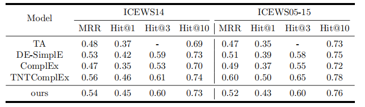

# Comprehension and Development for Temporal Knowledge Graph Completion

This is the code for the report "Comprehension and Development for Temporal Knowledge Graph Completion" for **MIRA lab** verification.

As time limits, we only test several groups of parameters for two dataset.

## Dependencies

- Python 3.7+
- Pytorch 1.7.0+
- Numpy 1.17.2+
- tqdm 4.41.1+


## Results



## Reproduce the Results

For **ICEWS14**, run the following commands.

```shell
python main.py --dataset ICEWS14 --optimizer Adagrad --max_epochs 100 --valid 10 --rank 200 --batch_size 128 --reg 0.1 --time_reg 0.1 --learning_rate 0.1 
```

For **ICEWS05-15**, run the following commands.

```shell
python main.py --dataset ICEWS05-15 --optimizer Adagrad --max_epochs 100 --valid 10 --rank 150 --batch_size 128 --reg 0.1 --time_reg 0.1 --learning_rate 0.1 
```

